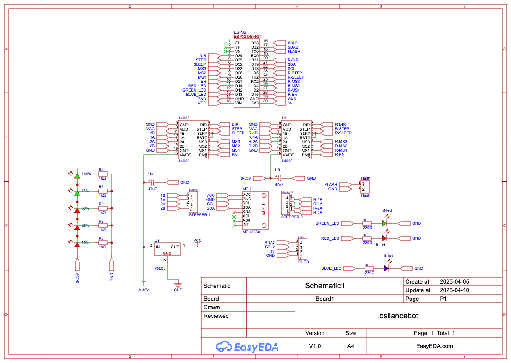
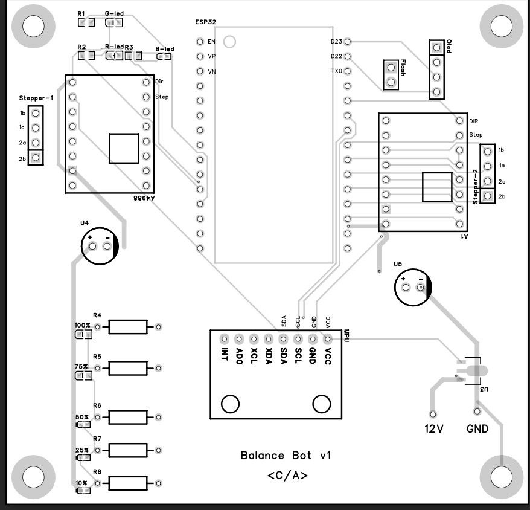
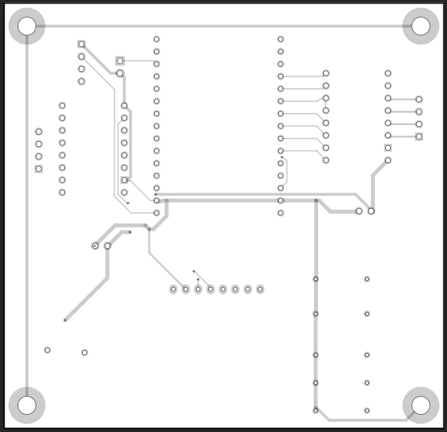

# BallanceBot

BallanceBot is a two-wheeled balancing robot designed as a learning platform for PID (Proportional-Integral-Derivative) control. This project demonstrates the principles of control systems and robotics using commonly available hardware components.

## Features

- **PID Control**: Implements a PID algorithm to maintain balance.
- **Stepper Motors**: Powered by two NEMA stepper motors for precise movement.
- **Motor Drivers**: Utilizes A4988 motor drivers for controlling the stepper motors.
- **IMU Sensor**: Uses an MPU6050 for real-time orientation and acceleration data.
- **Microcontroller**: Built around the ESP32 for processing and control.

## Hardware Requirements

- 2 × NEMA stepper motors
- 2 × A4988 motor drivers
- 1 × MPU6050 (IMU sensor)
- 1 × ESP32 microcontroller
- Power supply and wiring

pcb

